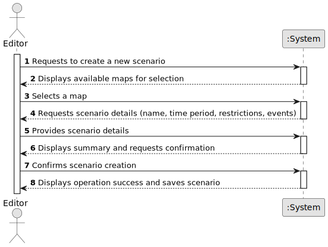

# US006 - Create a Task

## 1. Requirements Engineering

### 1.1. User Story Description

As an Editor, I want to create a scenario for a selected map so that the simulation environment can be customized with specific rules and conditions

### 1.2. Customer Specifications and Clarifications 

**From the specifications document:**

>	A scenario is defined by associating a selected map with specific constraints, including time restrictions, technological limitations, and historical events that impact the railway simulation. 

>	A scenario must be linked to an existing map and must define the available locomotives, industries, and operational conditions. 

**From the client clarifications:**

> **Question:** 
>
> **Answer:** 

> **Question:**
>
> **Answer:** 

### 1.3. Acceptance Criteria

* **AC1:** A scenario must be linked to an existing map.
* **AC2:** The Editor must provide a unique scenario name.
* **AC3:** The system must allow defining time, technological, and historical restrictions.
* **AC4:** The system must prevent duplicate scenario names within the same map.
* **AC5:** The Editor must confirm the scenario creation before finalizing it

### 1.4. Found out Dependencies

* There is a dependency on US001 - Create a Map, as a scenario cannot be created without an existing map.
* There is a dependency on US002 - Add an Industry and US003 - Add a City, as these elements may be part of scenario constraints.

### 1.5 Input and Output Data

**Input Data:**

* Typed data:
  * Scenario name (must be unique within the map)

  * Time restrictions (start and end date)

  * Technological restrictions (available locomotives, industries, etc.)

  * Historical restrictions (events affecting the simulation)
	
* Selected data:
  * A previously created map 

**Output Data:**

* List of available maps for selection
* Confirmation of scenario creation
* (In)Success message in case of duplicate scenario names

### 1.6. System Sequence Diagram (SSD)

**_Other alternatives might exist._**

### 1.7 Other Relevant Remarks

* The created task stays in a "not published" state in order to distinguish from "published" tasks.