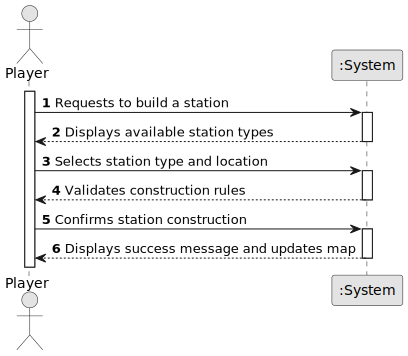

# US005 - Build a Station

## 1. Requirements Engineering

### 1.1. User Story Description

As a Player, I want to build a station so that it can serve cities and industries in the railway network.

### 1.2. Customer Specifications and Clarifications 

**From the specifications document:**

>	Each station must be placed on a valid map location and cannot overlap existing stations or other structures. 

>	The system should provide feedback if the placement is invalid. 

>   A station, once built, becomes part of the railway network and serves nearby cities and industries.

**From the client clarifications:**

> **Question:** What station types are available?
>
> **Answer:** 

> **Question:** Can stations be upgraded after being built?
>
> **Answer:**

> **Question:** Is there a cost associated with station construction?
> **Answer:**

### 1.3. Acceptance Criteria

* **AC1:** The player must select a valid station type before constructing.
* **AC2:** The system must verify that the selected location is suitable (i.e., no overlap, valid terrain).
* **AC3:** If placement is invalid, the system must reject the request and prompt the player to choose another location.
* **AC4:** Once built, the station must appear on the map and integrate into the railway network.

### 1.4. Found out Dependencies

* There is a dependency on US001 - Create a Map, as stations must be placed on an existing map.

* There is a dependency on US004 - Create a Scenario, as station availability may be scenario-dependent.

* There is a dependency on US006 - Upgrade a Station, as upgrading is a potential future feature.

### 1.5 Input and Output Data

**Input Data:**

* Selected data:
    * Station type (Depot, Station, Terminal)
    * XY coordinates for placement

**Output Data:**

* Confirmation of station construction
* Error message if placement is invalid
* Updated railway network data

### 1.6. System Sequence Diagram (SSD)

**_Other alternatives might exist._**

### 1.7 Other Relevant Remarks

* The system should provide a visual indicator to show the station's economic radius before placement.

* The station's effect on the railway network (cargo/passenger handling) should be updated after construction.

* Players should have an option to cancel the construction process before confirming placement.

* A budget system should be enforced, deducting the appropriate amount when a station is built.