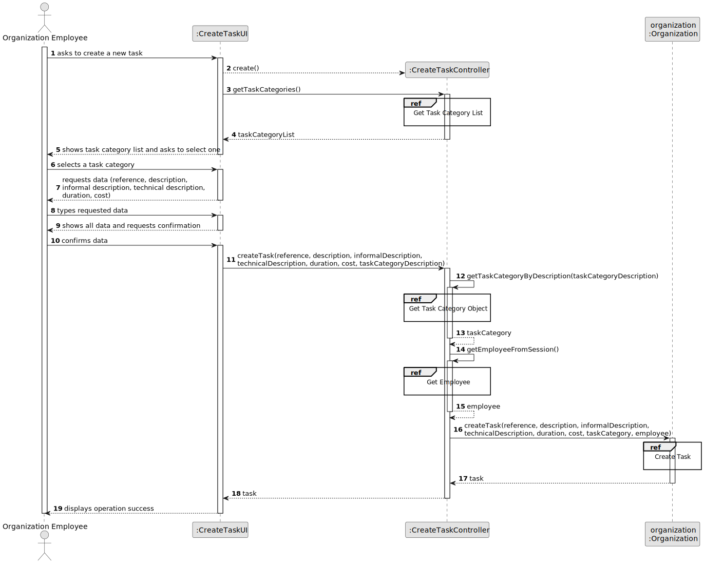
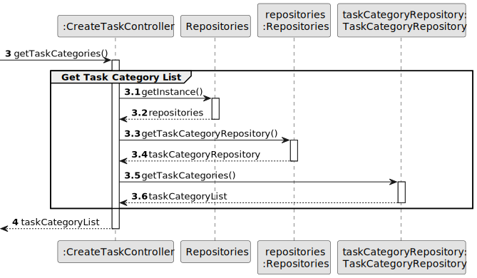
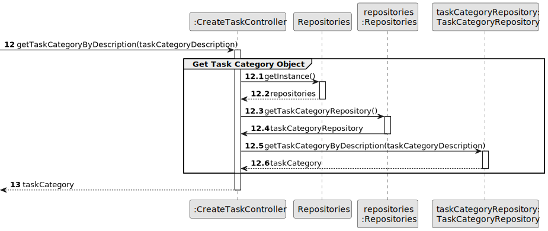
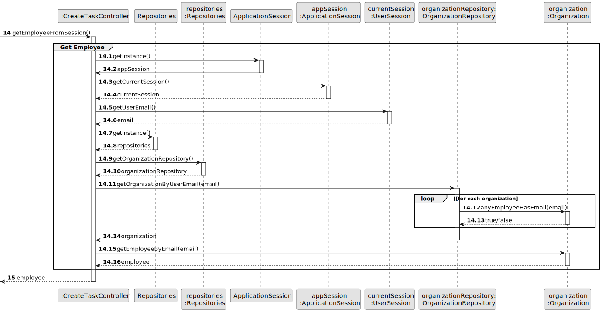
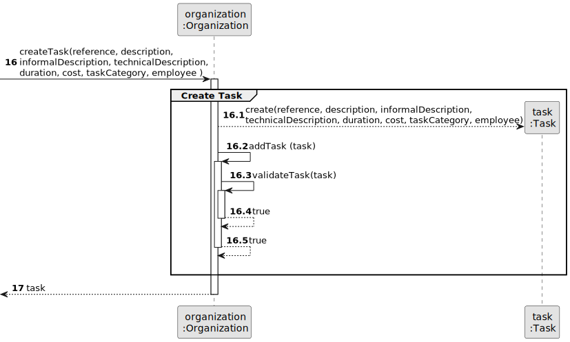
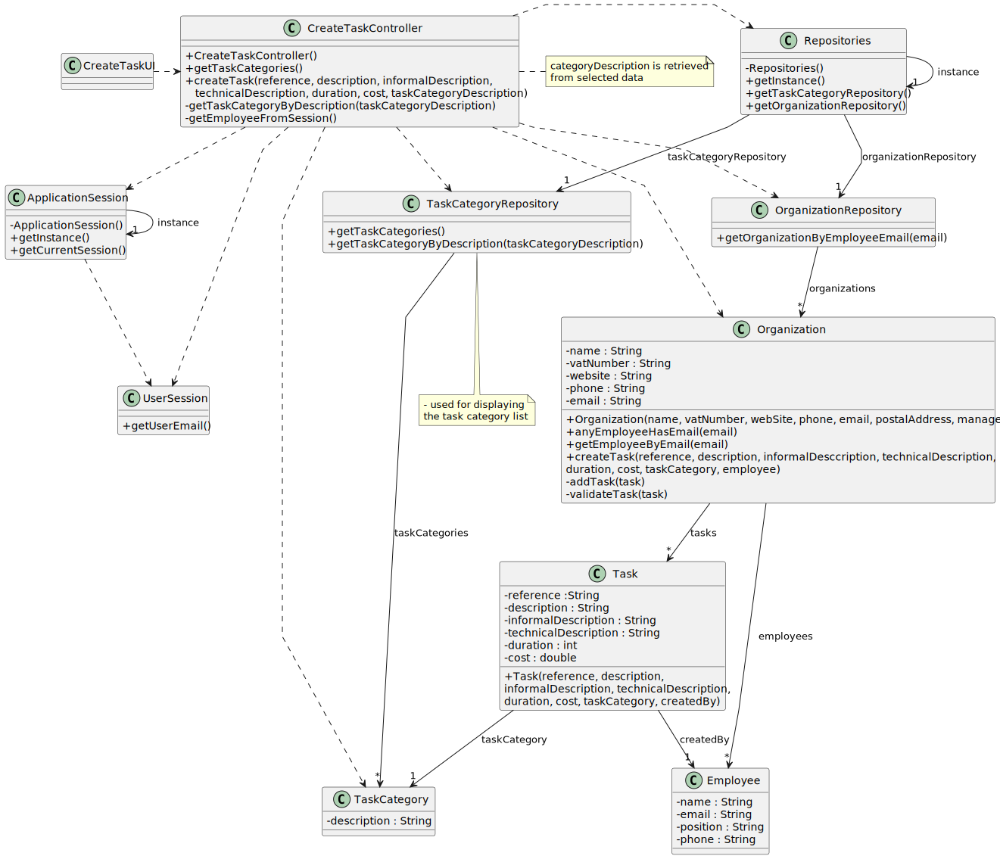

# US006 - Create a Task

## 3. Design

### 3.1. Rationale

| Interaction ID | Question: Which class is responsible for...        | Answer                 | Justification (with patterns)                                                                                                       |
|:---------------|:---------------------------------------------------|:-----------------------|:------------------------------------------------------------------------------------------------------------------------------------|
| Step 1         | ... interacting with the actor?                    | CreateTaskUI           | Pure Fabrication: there is no reason to assign this responsibility to any existing class in the Domain Model.                       |
|                | ... coordinating the US?                           | CreateTaskController   | Controller                                                                                                                          |
|                | ... knowing the user using the system?             | UserSession            | IE: cf. A&A component documentation.                                                                                                |
|                |                                                    | Organization           | IE: knows/has its own Employees                                                                                                     |
|                |                                                    | Employee               | IE: knows its own data (e.g. email)                                                                                                 |
| Step 2         | ... knowing all existing task categories to show?  | Repositories           | IE: Repositories maintains Task Categories.                                                                                         |
|                |                                                    | TaskCategoryRepository | By applying High Cohesion (HC) + Low Coupling (LC) on class Repositories, it delegates the responsibility on TaskCategoryContainer. |
| Step 3         | ... saving the selected category?                  | CreateTaskUI           | IE: is responsible for keeping the selected category.                                                                               |
| Step 4         | ... requesting data?                               | CreateTaskUI           | IE: is responsible for user interactions.                                                                                           |
| Step 5         | ... saving the inputted data?                      | CreateTaskUI           | IE: is responsible for keeping the inputted data.                                                                                   |
| Step 6         | ... showing all data and requesting confirmation?  | CreateTaskUI           | IE: is responsible for user interactions.                                                                                           |              
| Step 7         | ... instantiating a new Task?                      | Organization           | Creator (Rule 1): in the DM Organization has a Task.                                                                                |
|                | ... validating all data (local validation)?        | Task                   | IE: owns its data.                                                                                                                  | 
|                | ... validating all data (global validation)?       | Organization           | IE: knows all its tasks.                                                                                                            | 
|                | ... saving the created task?                       | Organization           | IE: owns all its tasks.                                                                                                             | 
| Step 8         | ... informing operation success?                   | CreateTaskUI           | IE: is responsible for user interactions.                                                                                           | 

### Systematization ##

According to the taken rationale, the conceptual classes promoted to software classes are: 

* Organization
* Task
* TaskCategory
* Employee

Other software classes (i.e. Pure Fabrication) identified: 

* CreateTaskUI  
* CreateTaskController
* Repositories
* TaskCategoryRepository
* OrganizationRepository
* ApplicationSession
* UserSession

## 3.2. Sequence Diagram (SD)

### Full Diagram

This diagram shows the full sequence of interactions between the classes involved in the realization of this user story.

### Split Diagrams

The following diagram shows the same sequence of interactions between the classes involved in the realization of this user story, but it is split in partial diagrams to better illustrate the interactions between the classes.

It uses Interaction Occurrence (a.k.a. Interaction Use).

**Get Task Category List Partial SD**

**Get Task Category Object**

**Get Employee**

**Create Task**

## 3.3. Class Diagram (CD)

