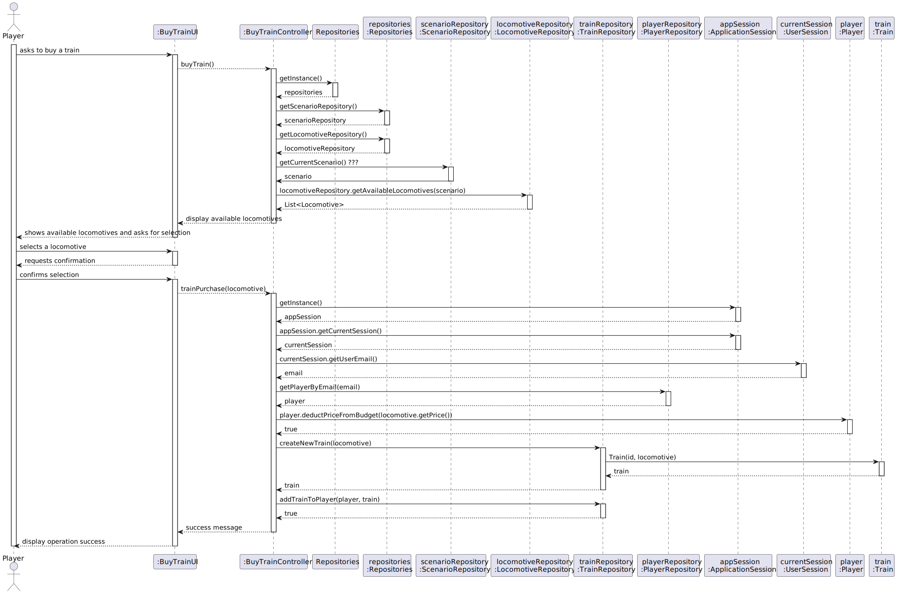

# US009 - As a Player, I want to buy a train.

## 3. Design

### 3.1. Rationale

| Interaction ID | Question: Which class is responsible for...        | Answer                 | Justification (with patterns)                                                                                                       |
|:---------------|:---------------------------------------------------|:-----------------------|:------------------------------------------------------------------------------------------------------------------------------------|
| Step 1         | ... interacting with the actor?                    | BuyTrainUI             | Pure Fabrication: there is no reason to assign this responsibility to any existing class in the Domain Model.                       |
|                | ... coordinating the US?                           | BuyTrainController     | Controller                                                                                                                          |
|                | ... knowing the user using the system?             | UserSession            | IE: cf. A&A component documentation.                                                                                                |
|                |                                                    | ApplicationSession     | IE: provides access to the current user session.                                                                                   |
|                |                                                    | PlayerRepository       | IE: retrieves the player data based on session information.                                                                        |
| Step 2         | ... knowing all available locomotives?             | Repositories           | IE: Repositories maintains Locomotive data.                                                                                        |
|                |                                                    | ScenarioRepository     | IE: retrieves the current scenario to determine available locomotives.                                                             |
|                |                                                    | LocomotiveRepository   | By applying High Cohesion (HC) + Low Coupling (LC) on class Repositories, it delegates the responsibility on LocomotiveRepository. |
| Step 3         | ... saving the selected locomotive?                | BuyTrainUI             | IE: is responsible for keeping the selected locomotive.                                                                            |
| Step 4         | ... requesting confirmation?                       | BuyTrainUI             | IE: is responsible for user interactions.                                                                                           |
| Step 5         | ... validating player budget?                      | Player                 | IE: owns the budget data.                                                                                                          |
|                | ... deducting the price?                           | Player                 | IE: modifies its own budget.                                                                                                       |
| Step 6         | ... instantiating a new Train?                     | TrainRepository        | Creator: TrainRepository is responsible for managing train instances.                                                              |
|                | ... linking the new Train to the Player?           | TrainRepository        | IE: manages player-owned trains.                                                                                                   |
| Step 7         | ... informing operation success?                   | BuyTrainUI             | IE: is responsible for user interactions.                                                                                           |

### Systematization ##

According to the taken rationale, the conceptual classes promoted to software classes are:

* Player
* Train
* Locomotive
* Scenario

Other software classes (i.e. Pure Fabrication) identified:

* BuyTrainUI
* BuyTrainController
* Repositories
* LocomotiveRepository
* ScenarioRepository
* TrainRepository
* PlayerRepository
* ApplicationSession
* UserSession

## 3.2. Sequence Diagram (SD)

### Full Diagram

This diagram shows the full sequence of interactions between the classes involved in the realization of this user story.

## 3.3. Class Diagram (CD)

