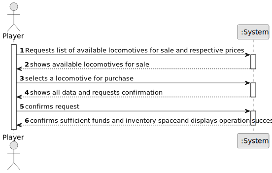

# US009 - Buy a Train

## 1. Requirements Engineering

### 1.1. User Story Description

As a Player, I want to buy a train.

### 1.2. Customer Specifications and Clarifications

**From the specifications document:**

> The player should be able to choose a locomotive from a list of available locomotives specific to the scenario.

> The locomotives available should be filtered based on the current date in the simulation.

**From the client clarifications:**

> **Question:** Can the player purchase multiple trains at once?  
> **Answer:** No, each train must be purchased individually.

> **Question:** Are there any budget constraints when buying a train?  
> **Answer:** Yes, the player must have enough funds available to complete the purchase.

### 1.3. Acceptance Criteria

* **AC1:** The player must be able to view a list of locomotives available for purchase.
* **AC2:** The available locomotives should be filtered based on the scenario and the simulation’s current date.
* **AC3:** The player must confirm the purchase before finalizing it.
* **AC4:** The system must deduct the cost of the train from the player's budget upon successful purchase.
* **AC5:** If the player lacks sufficient funds, the purchase should not proceed, and an appropriate message must be displayed.

### 1.4. Found out Dependencies

* US04 - Create a Scenario → The available locomotives for purchase are defined in the scenario.
* US05 - Build a Station → Trains require at least one station to operate meaningfully.

### 1.5. Input and Output Data

**Input Data:**
* Selected data:
  * Locomotive from the list
  * Confirmation of purchase

**Output Data:**
* Updated list of available funds
* Confirmation of purchase success or failure
* Updated train inventory

### 1.6. System Sequence Diagram (SSD)

### 1.7. Other Relevant Remarks

* Purchased trains are stored in the player’s train inventory.
* Player must have available inventory space (TBD).
