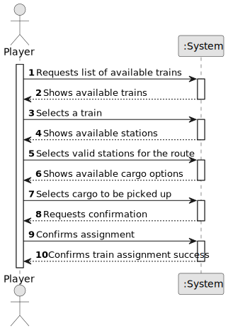

# US010 - As a Player, I want to assign a selected train to a route with a valid station and the respective list of cargoes to be picked up

## 1. Requirements Engineering

### 1.1. User Story Description

As a Player, I want to assign a selected train to a route with a valid station and the respective list of cargoes to be picked up.

### 1.2. Customer Specifications and Clarifications

**From the specifications document:**

> The player must be able to assign a train to a specific route consisting of valid stations.

> The player should be able to specify which cargoes the train will pick up at each station along the route.

**From the client clarifications:**

> **Question:** Can the player assign a train to any station, or must it be connected by a railway line?  
> **Answer:** The train can only be assigned to stations that are connected by an existing railway line.

> **Question:** Can multiple cargo types be assigned to the same train?  
> **Answer:** Yes, as long as the train has sufficient capacity and the cargo type is available at the station.

### 1.3. Acceptance Criteria

* **AC1:** The player must be able to view a list of available trains for assignment.
* **AC2:** The system should only allow assignment to valid stations connected by a railway line.
* **AC3:** The player must be able to specify which cargoes the train will pick up at each station.
* **AC4:** The system should verify that the train has sufficient capacity for the selected cargoes.
* **AC5:** The assignment should be stored and reflected in the player’s train schedule.

### 1.4. Found out Dependencies

* US05 - Build a Station → Stations must exist before a train can be assigned to a route.
* US08 - Build a Railway Line → The train must be assigned only to routes where valid railway lines exist.
* US09 - Buy a Train → A train must be purchased before it can be assigned to a route.

### 1.5. Input and Output Data

**Input Data:**
* Selected train
* Selected route (list of valid stations)
* Selected cargoes for each station

**Output Data:**
* Updated train schedule
* Confirmation of successful or failed assignment

### 1.6. System Sequence Diagram (SSD)

### 1.7. Other Relevant Remarks

* A train cannot be assigned to an invalid station.
* The system should prevent overloading a train beyond its cargo capacity.
* If a cargo is unavailable at a selected station, the system should notify the player.
