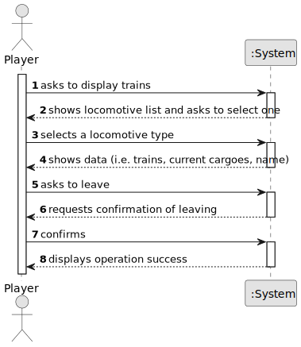

# US011 - List All Trains

## 1. Requirements Engineering

### 1.1. User Story Description

As a Player, I want to list all trains.

### 1.2. Customer Specifications and Clarifications 

**From the specifications document:**

> The display of trains must include the locomotive and the current cargoes.

> The trains should be grouped by locomotive type and then listed alphabetically by name.

**From the client clarifications:**

> **Question:** TBA
>
> **Answer:** TBA

### 1.3. Acceptance Criteria

* **AC1:** The display of trains must include the locomotive and the current cargoes;
* **AC2:** The trains should be grouped by locomotive type and then listed alphabetically by name.

### 1.4. Found out Dependencies

* Has a dependence on US09 (Buy a train) as its necessary to have available trains to get a list for it.

### 1.5 Input and Output Data

**Input Data:**
	
* Selected data:
    * Locomotive

**Output Data:**

* List of locomotives' categories
* List of trains for selected locomotive, alphabetically, with their names and current cargoes 
* (In)Success of the operation

### 1.6. System Sequence Diagram (SSD)

**_Other alternatives might exist._**

### 1.7 Other Relevant Remarks

* N/A