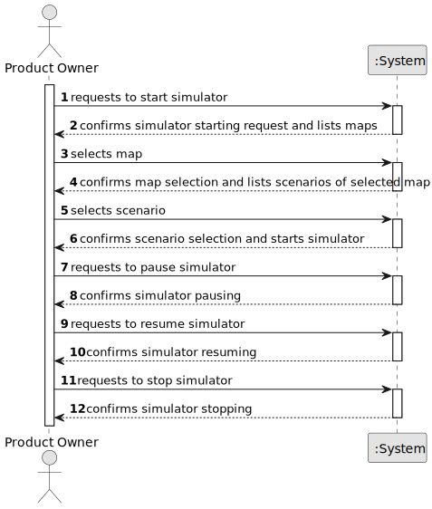

# US012 - Create a Simulator

## 1. Requirements Engineering

### 1.1. User Story Description

As a Product Owner, I want to create a simulator that generates
cargoes at current stations.

### 1.2. Customer Specifications and Clarifications 

**From the specifications document:**

> The simulator should provide options for start/pause.

> Automatically, it should consider the cities and industries that the railway network serves for current stations.

**From the client clarifications:**

> **Question:** TBA
>
> **Answer:** TBA

### 1.3. Acceptance Criteria

* **AC1:** The simulator should provide options for start/pause.

### 1.4. Found out Dependencies

* Has dependency on US01 (Create a Map) as its needed maps to be able to select and on US04 (Create a Scenario) as its necessary a scenario for the simulator run the map

### 1.5 Input and Output Data

**Input Data:**
	
* Selected data:
    * TBA

**Output Data:**

* Map
* Map UI (With Pausing, Resuming and Stop buttons)
* (In)Success of the operation

### 1.6. System Sequence Diagram (SSD)

**_Other alternatives might exist._**

### 1.7 Other Relevant Remarks

* N/A