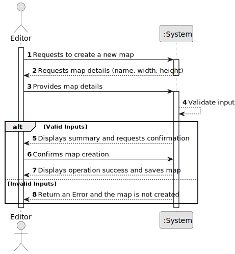

# US001 - Create a Map

## 1. Requirements Engineering

### 1.1. User Story Description

As an Editor, I want to create a map with a size and a name.

### 1.2. Customer Specifications and Clarifications 

**From the specifications document:**

>	Each map is characterized by having a name and size. 

>	After the creation of the map, it's possible to place static elements on it such as cities or industries. 

**From the client clarifications:**

> **Question:** 
>
> **Answer:** 

> **Question:** 
>
> **Answer:** 

### 1.3. Acceptance Criteria

* **AC1:** Maps canno't have the same name.
* **AC2:** For the size, width and height must be positives.

### 1.4. Found out Dependencies

* There is no dependencies.

### 1.5 Input and Output Data

**Input Data:**

* Typed data:
    * name (must be unique)
    * width (must be positive)
    * height (must be positive)

**Output Data:**

* (In)Success of the operation.
* In case of success, the system must send a confirmation that the map was created. Otherwise, it should send an error.

### 1.6. System Sequence Diagram (SSD)

### 1.7 Other Relevant Remarks

* So far no observations.