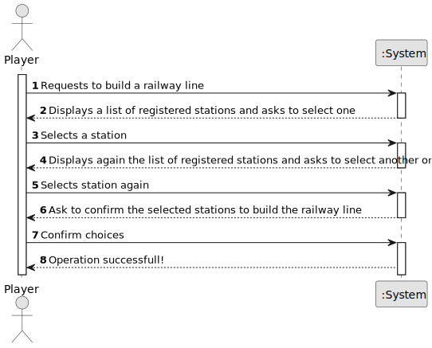

# US008 - Build a railway line between two stations

## 1. Requirements Engineering

### 1.1. User Story Description

As a Player, I want to build a railway line between two stations.

### 1.2. Customer Specifications and Clarifications 

**From the specifications document:**

>	There are three types of stations: Depots, Stations, and Terminals.

**From the client clarifications:**

> **Question:**
>
> **Answer:**

### 1.3. Acceptance Criteria

> **AC1:  The player should choose the stations from a list of registered stations.**

### 1.4. Found out Dependencies

> US05 - As a Player, I want to build a station.
> It will be necessary to have already built more than one station to build a railway line

### 1.5 Input and Output Data

**Output Data:**

* (In)Success of the operation.

### 1.6. System Sequence Diagram (SSD)

### 1.7 Other Relevant Remarks

> It will be necessary to have already built more than one station to build a railway line 